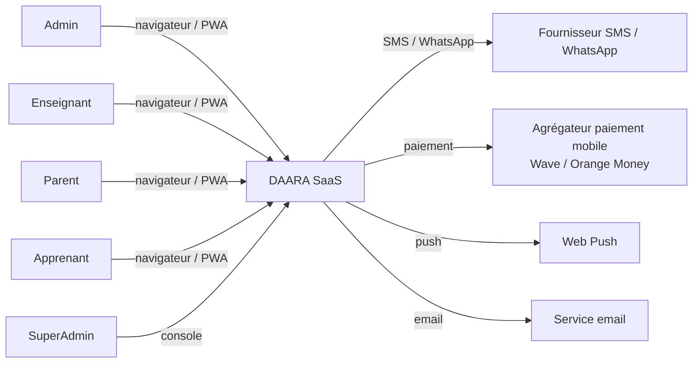
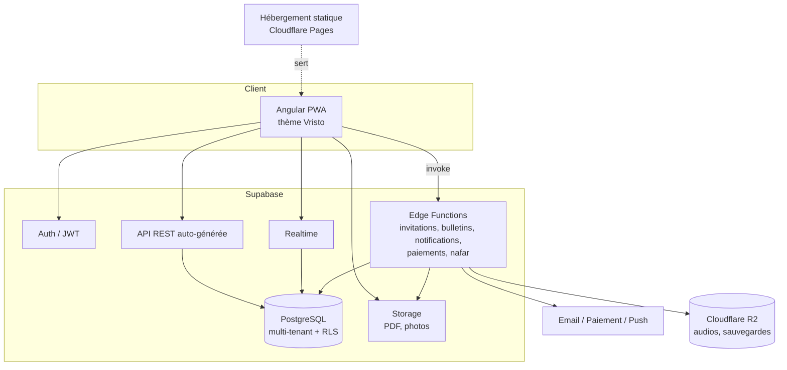

# HLD — High Level Design · DAARA SaaS

Version 1.0 · Statut : référence · Détails d'implémentation : `docs/LLD.md`

## 1. Contexte et objectifs
DAARA est un SaaS de gestion complète des daaras (écoles coraniques et franco-arabes).
Chaque daara dispose d'un espace isolé, administré par un admin, avec enseignants, parents et apprenants.

Objectifs :
- Centraliser la gestion scolaire : classes, matières, apprenants, absences, notes, bulletins.
- Suivre l'apprentissage du Coran : cahier numérique, récitations, moteur nafar.
- Donner aux parents une visibilité en temps réel.
- Être exploitable dans le contexte local : mobile, connexion instable, français/anglais (arabe plus tard), paiement mobile.

Hors périmètre V1 : application mobile native (V2 Flutter), visioconférence, IA de correction du Tajwid.

## 2. Acteurs
| Acteur | Rôle |
|---|---|
| Super-admin | Exploitant de la plateforme : daaras, offres, facturation, support |
| Admin daara | Configure sa daara, gère les membres, l'année scolaire, publie les bulletins |
| Enseignant | Saisit absences, notes, suivi Coran ; corrige les récitations (un seul rôle, spécialisé par affectations) |
| Parent | Consulte les données de ses enfants (lecture seule), reçoit les notifications |
| Apprenant | Consulte ses résultats et son cahier, envoie ses récitations |

## 3. Vue de contexte

## 4. Vue des conteneurs

Spring Boot n'est pas dans la V1. Il pourra s'ajouter comme service connecté à la même base pour les
traitements lourds si les Edge Functions deviennent insuffisantes.

## 5. Découpage fonctionnel
Les modules métier sont **activables par daara** (ADR-008) : une daara ne voit que ceux qu'elle a activés.

| Module | Contenu | Sprints |
|---|---|---|
| Socle | Auth, daaras, membres, rôles, invitations, audit, layout | 1-2 |
| Structure scolaire | Années, périodes, classes, matières, affectations | 3 |
| Apprenants | Fiches, inscriptions, liens parents, import | 4 |
| Vie scolaire | Absences temps réel, espace parent | 5 |
| Évaluations | Évaluations, notes, moyennes | 6 |
| Bulletins | Calcul, rang, PDF, publication | 7 |
| Notifications & tableaux de bord | Push, SMS/WhatsApp, rapports | 8 |
| Coran | Cahier, récitations audio, moteur nafar | 9-10 |
| SaaS | Offres, limites, paiement, super-admin | 11 |

## 6. Choix d'architecture
| Sujet | Décision | Référence |
|---|---|---|
| Backend | Supabase (BaaS Postgres) | ADR-001 |
| Multi-tenant | Base partagée, `daara_id` partout, RLS, memberships | ADR-002 |
| Front | Angular 22 standalone + signals, zoneless, PWA, thème Vristo | ADR-004 |
| Logique métier | SQL (vues, fonctions, triggers) pour les données ; Edge Functions pour l'externe | — |
| Temps réel | Supabase Realtime filtré par daara | — |
| URL | Daara active dans l'URL : `/d/:slug/...` | LLD §2 |

## 7. Multi-tenant et sécurité
- **Isolation** : chaque ligne métier porte `daara_id`. Les politiques RLS autorisent l'accès uniquement aux
  membres actifs de la daara, selon leur rôle (`memberships`). Les parents ne voient que leurs enfants
  (`parent_links`).
- **Authentification** : Supabase Auth (e-mail + mot de passe, flux PKCE), double authentification (TOTP)
  obligatoire pour les admins, récupération d'accès par code e-mail ou assistée par l'admin de la daara
  (ADR-006) ; identifiant sans e-mail : téléphone + mot de passe sans SMS (ADR-009).
- **Autorisation** : RLS = source de vérité. Guards Angular = confort d'interface uniquement.
- **Secrets** : clé `anon` seule côté front ; `service_role` uniquement dans les Edge Functions.
- **Traçabilité** : journal d'audit sur les tables sensibles (notes, absences, bulletins, membres).
- **Données de mineurs** : minimisation, accès parent contrôlé, pas de données personnelles dans les logs,
  conformité à la loi sénégalaise sur les données personnelles (CDP).
- **Vérification** : tests pgTAP d'isolation inter-daara obligatoires, audit de sécurité à chaque feature.

## 8. Temps réel et notifications
| Besoin | Mécanisme |
|---|---|
| Écran ouvert mis à jour | Realtime (abonnement filtré par `daara_id`) |
| Utilisateur absent de l'app | Notification in-app + Web Push ; SMS/WhatsApp pour les événements importants |
| Traitement lourd | Edge Function asynchrone |
Montée en charge : migration progressive vers le mode Broadcast déclenché par triggers.

## 9. Environnements et déploiement
| Environnement | Base | Front | Accès Claude Code |
|---|---|---|---|
| Local | `supabase start` (Docker) | `npm start` | Total |
| Dev / recette | Projet Supabase Free `daara-dev` | Preview Cloudflare Pages (`develop`) | Lecture seule (MCP) |
| Production | Projet Supabase Free `daara-prod` (Pro plus tard) | Cloudflare Pages (`main`) | Aucun |
Fonctionnement sans abonnement jusqu'aux premiers revenus : voir ADR-003.
Pipeline : lint → tests unitaires → tests RLS (pgTAP) → build → scan secrets → déploiement preview.
Les migrations vers dev/prod sont appliquées manuellement par le développeur.

## 10. Exigences non fonctionnelles
| Exigence | Cible |
|---|---|
| Performance | Écran principal < 3 s en 3G ; listes paginées côté serveur |
| Temps réel | Mise à jour visible < 2 s |
| Disponibilité | Celle de Supabase Pro / hébergeur statique |
| Volumétrie V1 | 100 daaras × 500 apprenants |
| Mobile | Écrans parents utilisables dès 375 px |
| Langues | Interface en français (défaut) et anglais ; arabe (RTL) et wolof plus tard (ADR-005) |
| Sauvegardes | Sauvegardes quotidiennes Supabase + export mensuel |
| Accessibilité | Contrastes, taille de police, navigation clavier sur les formulaires |

## 11. Intégrations externes
| Service | Usage | Sprint |
|---|---|---|
| Web Push | Notifications PWA (gratuit) | 8 |
| WhatsApp (liens `wa.me`, envoi manuel) | Alertes parents ; SMS payant reporté | 8 |
| Email (Brevo, SMTP de Supabase Auth) | Invitations, mot de passe | 0-2 |
| Cloudflare R2 | Audios de récitation, sauvegardes | 0, 9 |
| Sentry | Suivi des erreurs | 0 |
| Agrégateur de paiement mobile (ex. PayTech : Wave, Orange Money) | Abonnements | 11 |

## 12. Risques
| Risque | Impact | Mitigation |
|---|---|---|
| Faille RLS (fuite inter-daara) | Critique | Tests pgTAP obligatoires, agent auditeur-rls, revue à chaque migration |
| Algorithme nafar non spécifié | Bloque le module Coran | `docs/nafar.md` à rédiger pendant les sprints 1-8 |
| Faible adoption numérique des parents | Valeur perçue faible | SMS/WhatsApp, écrans parents très simples |
| PDF en arabe (mise en forme RTL) | Bulletins incomplets | Spike technique au sprint 7 (ADR) |
| Dépendance à Supabase | Moyen | Postgres standard, auto-hébergement possible |
| Limites de l'offre gratuite (taille, pas de sauvegardes) | Moyen | Sauvegardes vers R2, purge audit_log, seuils de passage à Pro (ADR-003) |
| Capacité de l'équipe (temps partiel) | Retards | Sprints courts, périmètre fixe, priorisation stricte |
