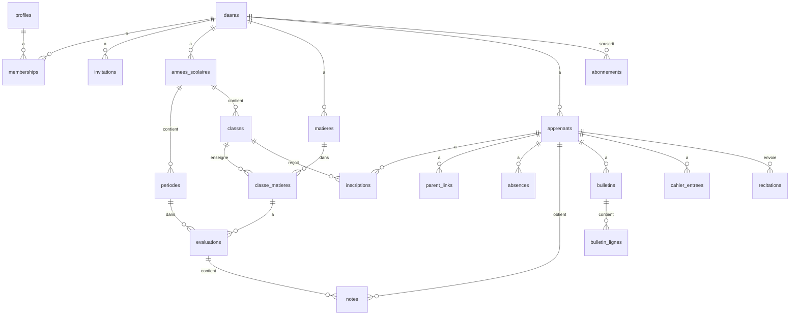
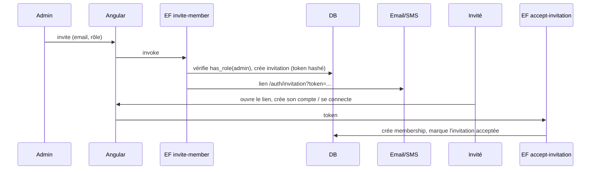
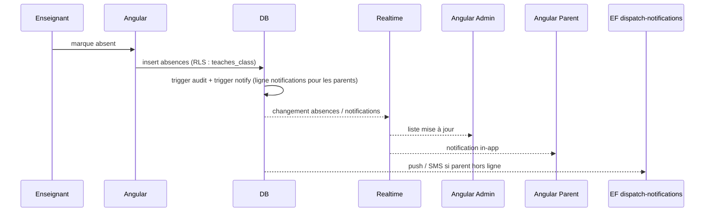

# LLD — Low Level Design · DAARA SaaS

Version 1.0 · Document vivant : chaque sprint détaille ici ce qu'il implémente AVANT de coder.
Les sections marquées « À détailler » le seront au sprint concerné.

## 1. Conventions
- SQL : snake_case, tables au pluriel, `id uuid default gen_random_uuid()`, `created_at timestamptz`.
- Toute table métier : `daara_id uuid not null`, index, RLS (voir `.claude/rules/supabase-rls.md`).
- Tables de référence globales (sans daara_id) : `sourates`, `offres` — lecture seule pour `authenticated`.
- TypeScript : types générés `database.types.ts`, aucun `any`.
- Dates stockées en UTC, affichées en `Africa/Dakar`.

## 2. Architecture Angular
```
src/app/
├── core/
│   ├── supabase/        supabase.service.ts, database.types.ts
│   ├── auth/            auth.service.ts, auth.guard.ts, role.guard.ts
│   ├── daara/           current-daara.service.ts, daara.resolver.ts
│   ├── i18n/            language.service.ts (fr, en) — traductions dans public/i18n/{fr,en}.json
│   ├── theme/           theme.service.ts (clair / sombre / système)
│   ├── notifications/   notification-center.service.ts, push.service.ts
│   └── errors/          error-handler, messages utilisateur
├── shared/ui/           data-table, form-field, modal, confirm-dialog, stat-card, badge, empty-state, page-header
├── layouts/             auth-layout, app-layout (menu selon rôle), layout.service.ts (état de la sidebar)
└── features/
    ├── auth/            connexion, inscription, mot de passe, acceptation d'invitation
    ├── onboarding/      création de daara, sélection de daara
    ├── membres/         membres, invitations, rôles
    ├── structure/       années, périodes, classes, matières, affectations
    ├── apprenants/      fiches, inscriptions, parents, import CSV
    ├── absences/
    ├── evaluations/     évaluations, saisie des notes
    ├── bulletins/
    ├── parent/          tableau de bord parent
    ├── coran/           cahier, récitations, nafar
    ├── dashboard/       tableaux de bord par rôle
    ├── parametres/      paramètres de la daara (barème, logo...)
    └── admin-plateforme/ super-admin
```

### Routage
```
/auth/...                          public
/onboarding                        connecté, sans daara
/select-daara                      connecté, plusieurs daaras
/d/:slug                           DaaraResolver → vérifie le membership, charge CurrentDaara
  ├── dashboard                    tous
  ├── membres                      admin
  ├── structure/...                admin
  ├── apprenants/...               admin, enseignant (lecture)
  ├── absences                     admin, enseignant
  ├── evaluations/...              admin, enseignant
  ├── bulletins/...                admin (gestion), parent/apprenant (consultation)
  ├── enfants/:apprenantId/...     parent
  ├── coran/...                    admin, enseignant, apprenant
  └── parametres                   admin
/plateforme/...                    super-admin
```

### Services transverses
| Service | Responsabilité |
|---|---|
| `SupabaseService` | Instance unique du client, configuration par environnement |
| `AuthService` | Session (signal `user`), connexion, déconnexion, écoute `onAuthStateChange` |
| `CurrentDaaraService` | Signals `daara`, `roles`, `id` ; `hasRole(...)` ; mémorise le dernier slug utilisé |
| `NotificationCenterService` | Abonnement Realtime à `notifications` de l'utilisateur, compteur non lus |
| `PushService` | Inscription Web Push (sprint 8) |
| `ThemeService` | Signal `mode` (clair / sombre / système), classe `dark` sur `<body>`, mémorisé dans `localStorage` |
| `LanguageService` | Signal `langue` (`fr` par défaut, `en`), `lang` sur `<html>`, bascule sans rechargement, mémorisé |

État : signals dans les services de feature ; pas de store global (NgRx) en V1. Application zoneless,
composants standalone OnPush, primitives @angular/cdk (Dialog, Menu, Overlay) : voir ADR-004.

## 3. Modèle de données

### 3.1 Diagramme


### 3.2 Socle (sprints 1-2)
| Table | Colonnes principales | Contraintes |
|---|---|---|
| `daaras` | nom, slug, ville, telephone, logo_path, langue_defaut, bareme (10/20), statut (active/suspendue) | slug unique |
| `profiles` | id (= auth.users.id), nom, prenom, telephone, langue, avatar_path | créé par trigger sur `auth.users` |
| `memberships` | daara_id, user_id, role (`admin`/`enseignant`/`parent`/`apprenant`), actif | unique (daara_id, user_id, role) |
| `invitations` | daara_id, email, telephone, role, token_hash, expires_at, accepted_at, invited_by | expire après 7 jours |
| `audit_log` | id bigserial, daara_id, table_name, record_id, action, old_data, new_data, user_id, at | insert par trigger uniquement |
| `platform_admins` | user_id | lecture via fonction `is_platform_admin()` |
| `notifications` | daara_id, user_id, type, titre, message, ref_table, ref_id, lue | RLS : user_id = auth.uid() |

### 3.3 Structure scolaire (sprint 3)
| Table | Colonnes principales | Contraintes |
|---|---|---|
| `annees_scolaires` | daara_id, libelle, date_debut, date_fin, active | une seule active par daara (index partiel unique) |
| `periodes` | daara_id, annee_id, libelle, ordre, date_debut, date_fin, cloturee | période clôturée = notes verrouillées |
| `classes` | daara_id, annee_id, nom, niveau, titulaire_id | unique (annee_id, nom) |
| `matieres` | daara_id, nom, code, type (`scolaire`/`coran`/`religieux`) | unique (daara_id, code) |
| `classe_matieres` | daara_id, classe_id, matiere_id, coefficient, enseignant_id | unique (classe_id, matiere_id) |

### 3.4 Apprenants (sprint 4)
| Table | Colonnes principales | Contraintes |
|---|---|---|
| `apprenants` | daara_id, matricule, nom, prenom, date_naissance, sexe, photo_path, user_id (optionnel), statut | matricule unique par daara |
| `inscriptions` | daara_id, apprenant_id, classe_id, annee_id, date_inscription | unique (apprenant_id, annee_id) |
| `parent_links` | daara_id, parent_user_id, apprenant_id, lien (père/mère/tuteur) | unique (parent_user_id, apprenant_id) |

### 3.5 Vie scolaire et évaluations (sprints 5-7)
| Table | Colonnes principales | Contraintes |
|---|---|---|
| `absences` | daara_id, apprenant_id, classe_id, date_absence, creneau (matin/après-midi/journée), justifiee, motif | unique (apprenant_id, date_absence, creneau) |
| `evaluations` | daara_id, classe_matiere_id, periode_id, libelle, type (devoir/composition), date_eval, bareme, coefficient | période non clôturée |
| `notes` | daara_id, evaluation_id, apprenant_id, valeur, absent, appreciation | unique (evaluation_id, apprenant_id) ; 0 ≤ valeur ≤ barème |
| `bulletins` | daara_id, apprenant_id, periode_id, moyenne, rang, effectif, appreciation, statut (brouillon/publie), pdf_path, publie_at | unique (apprenant_id, periode_id) |
| `bulletin_lignes` | bulletin_id, matiere_id, moyenne, coefficient, rang, appreciation, enseignant_nom | figées à la publication |

### 3.6 Coran (sprints 9-10) — À détailler après `docs/nafar.md`
| Table | Colonnes principales |
|---|---|
| `sourates` (référence) | numero, nom_ar, nom_fr, nb_versets |
| `cahier_entrees` | daara_id, apprenant_id, sourate_num, verset_debut, verset_fin, statut (non_commencee/en_cours/validee/a_reviser), maj_par, maj_at |
| `recitations` | daara_id, apprenant_id, sourate_num, verset_debut, verset_fin, audio_path, duree_s, statut (en_attente/valide/a_revoir), feedback_texte, feedback_audio_path, corrige_par, corrige_at |
| `devoirs` | daara_id, classe_id, apprenant_id (optionnel), type, description, sourate_num, deadline |
| `nafar_*` | selon la spécification |

### 3.7 SaaS (sprint 11)
| Table | Colonnes principales |
|---|---|
| `offres` (référence) | code, nom, max_apprenants, fonctionnalites jsonb, prix_mensuel |
| `abonnements` | daara_id, offre_code, statut, debut, fin |
| `paiements` | daara_id, abonnement_id, montant, fournisseur, reference, statut, payload jsonb |

## 4. Matrice des droits (RLS)
L = lecture, E = écriture (insert/update), S = suppression, — = aucun accès. « Les siens » = ses enfants (parent) ou soi (apprenant).

| Table | Admin | Enseignant | Parent | Apprenant |
|---|---|---|---|---|
| daaras | L E | L | L | L |
| memberships | L E S | L (sa daara) | L (soi) | L (soi) |
| invitations | L E S | — | — | — |
| annees / periodes / classes / matieres | L E S | L | L | L |
| classe_matieres | L E S | L | — | — |
| apprenants | L E S | L (ses classes) | L (les siens) | L (soi) |
| parent_links | L E S | — | L (soi) | — |
| absences | L E S | L E (ses classes) | L (les siens) | L (soi) |
| evaluations | L E S | L E (ses classe_matieres) | L publiées | L publiées |
| notes | L E S | L E (ses évaluations, période ouverte) | L (les siens) | L (soi) |
| bulletins | L E S | L (ses classes) | L publiés (les siens) | L publiés (soi) |
| cahier_entrees | L E | L E (ses apprenants) | L (les siens) | L (soi) |
| recitations | L | L E (correction) | L (les siens) | L E (envoi, soi) |
| audit_log | L | — | — | — |
| abonnements / paiements | L | — | — | — |

### Fonctions helpers
| Fonction | Rôle |
|---|---|
| `is_member(daara_id)` | membre actif de la daara |
| `has_role(daara_id, roles[])` | membre actif avec un des rôles |
| `is_parent_of(apprenant_id)` | lien dans `parent_links` |
| `teaches_class(classe_id)` | enseignant affecté à la classe (titulaire ou classe_matieres) |
| `is_platform_admin()` | super-admin |
Toutes : `security definer`, `stable`, `search_path = ''`, appelées via `(select ...)`.

### Triggers
| Trigger | Tables | Rôle |
|---|---|---|
| `handle_new_user` | auth.users | crée `profiles` |
| `audit_trigger` | memberships, absences, notes, bulletins, cahier_entrees | journal d'audit |
| `check_same_daara` | tables avec FK métier | refuse une référence vers une autre daara |
| `lock_closed_period` | notes, evaluations | refuse les modifications si période clôturée |
| `notify_*` | absences, bulletins (publication), recitations | crée les lignes `notifications` |

## 5. Storage
| Bucket | Chemin | Accès |
|---|---|---|
| `logos` | `{daara_id}/logo.png` | public en lecture |
| `photos` | `{daara_id}/apprenants/{apprenant_id}.jpg` | membres de la daara (staff) + parent concerné |
| `bulletins` | `{daara_id}/{periode_id}/{apprenant_id}.pdf` | admin ; parent/apprenant si publié |
Politiques sur `storage.objects` : premier segment du chemin = daara dont l'utilisateur est membre.
URLs signées à durée courte pour les fichiers privés.

**Audios de récitation : Cloudflare R2** (ADR-003), pas Supabase Storage.
- Clé : `{daara_id}/{apprenant_id}/{recitation_id}.webm` (Opus, bas débit, compressé dans le navigateur).
- Edge Function `audio-url` : vérifie le droit (apprenant soi / enseignant / parent) puis renvoie une URL
  signée R2 (upload ou lecture, 15 min).

**Sauvegardes** : GitHub Actions quotidien, `pg_dump` de `daara-prod` → R2 `backups/`, rétention 30 jours.

## 6. Edge Functions
| Fonction | Entrée | Sortie | Sécurité |
|---|---|---|---|
| `invite-member` | daara_id, email/téléphone, rôle | invitation créée, email/SMS envoyé | admin de la daara |
| `accept-invitation` | token | membership créé | utilisateur connecté, token valide non expiré |
| `generate-bulletins` | periode_id, classe_id | bulletins calculés + PDF | admin |
| `dispatch-notifications` | (planifiée / webhook DB) | push, SMS, WhatsApp | interne (service_role) |
| `payment-webhook` | payload fournisseur | paiement + abonnement mis à jour | signature du fournisseur |
| `audio-url` | recitation_id, mode (upload/lecture) | URL signée R2 | droits sur la récitation |
| `nafar-plan` | apprenant_id | planning | à définir |
Toutes vérifient le JWT, le membership et valident les entrées.

## 7. Flux principaux

### 7.1 Invitation d'un membre


### 7.2 Saisie d'une absence


### 7.3 Calcul des moyennes (sprint 6-7)
- Note ramenée sur 20 : `valeur / bareme_eval × 20`.
- Moyenne matière (période) : moyenne pondérée des notes par `coefficient` de l'évaluation.
  Absence à une évaluation : exclue ou comptée 0 selon le paramètre de la daara.
- Moyenne générale : moyenne des moyennes matières pondérée par `classe_matieres.coefficient`.
- Affichage converti dans le barème de la daara (10 ou 20).
- Rang : `rank() over (partition by classe, periode order by moyenne desc)`.
- Implémentation : fonction SQL `calculer_bulletins(periode_id, classe_id)` ; à la publication, les valeurs
  sont figées dans `bulletins` / `bulletin_lignes`.
- PDF : décision par ADR au sprint 7 (spike sur le rendu de l'arabe).

## 8. Gestion des erreurs
- Erreurs Supabase traduites en messages utilisateur français (violation RLS → « Accès non autorisé »,
  contrainte unique → message métier).
- Erreurs inattendues : journalisées (sans données personnelles) et affichées de manière générique.

## 9. Stratégie de test
| Niveau | Outil | Périmètre |
|---|---|---|
| Base | pgTAP (`supabase test db`) | RLS, fonctions, triggers, calculs de moyennes |
| Unitaire | Vitest (`@angular/build:unit-test`) | Services, composants |
| E2E | Playwright | Parcours critiques (connexion, absence → parent, notes → bulletin) |
| Sécurité | Agents auditeur-securite / auditeur-rls, scan secrets en CI | À chaque feature |

## 10. CI/CD
1. Lint + typecheck
2. Tests unitaires
3. `supabase start` + `supabase db reset` + `supabase test db`
4. Build production
5. Scan de secrets + `npm audit --audit-level=high`
6. Déploiement Cloudflare Pages : preview sur `develop`, production sur `main` ; migrations appliquées manuellement
7. Tâches planifiées : sauvegarde quotidienne → R2, requête anti-pause
