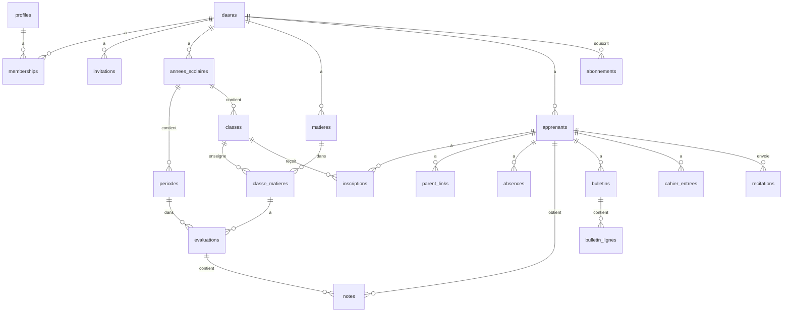
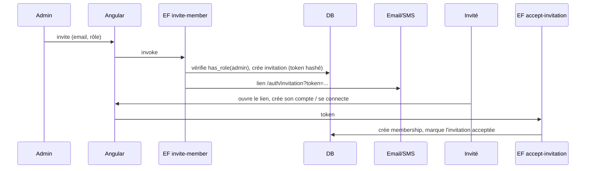
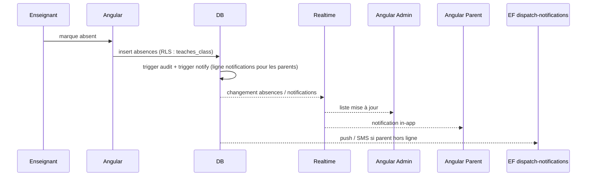

# LLD — Low Level Design · DAARA SaaS

Version 1.0 · Document vivant : chaque sprint détaille ici ce qu'il implémente AVANT de coder.
Les sections marquées « À détailler » le seront au sprint concerné.

## 1. Conventions
- SQL : snake_case, tables au pluriel, `id uuid default gen_random_uuid()`, `created_at timestamptz`.
- Toute table métier : `daara_id uuid not null`, index, RLS (voir `.claude/rules/supabase-rls.md`).
- Tables de référence globales (sans daara_id) : `sourates`, `offres` — lecture seule pour `authenticated`.
- TypeScript : types générés `database.types.ts`, aucun `any`.
- Dates stockées en UTC, affichées en `Africa/Dakar`.

## 2. Architecture Angular
```
src/app/
├── core/
│   ├── supabase/        supabase.service.ts, database.types.ts
│   ├── auth/            auth.service.ts, auth.guard.ts, role.guard.ts
│   ├── daara/           current-daara.service.ts, daara.resolver.ts
│   ├── i18n/            language.service.ts (fr, en), translated-title.strategy.ts — traductions dans public/i18n/{fr,en}.json
│   ├── theme/           theme.service.ts (clair / sombre / système)
│   ├── notifications/   notification-center.service.ts, push.service.ts
│   └── errors/          error-handler.ts (console + Sentry), sentry.ts (chargement différé, nettoyage des données
│                        personnelles), messages utilisateur (sprint 1)
├── shared/ui/           page-header, empty-state, badge, skeleton, form-field, confirm-dialog (S0.4) ; data-table (S3), stat-card
├── layouts/             auth-layout, app-layout (menu selon rôle), layout.service.ts (état de la sidebar)
└── features/
    ├── auth/            connexion, inscription, mot de passe, acceptation d'invitation
    ├── onboarding/      création de daara, sélection de daara
    ├── membres/         membres, invitations, rôles
    ├── structure/       années, périodes, classes, matières, affectations
    ├── apprenants/      fiches, inscriptions, parents, import CSV
    ├── absences/
    ├── evaluations/     évaluations, saisie des notes
    ├── bulletins/
    ├── parent/          tableau de bord parent
    ├── coran/           cahier, récitations, nafar
    ├── dashboard/       tableaux de bord par rôle
    ├── parametres/      paramètres de la daara (barème, logo...)
    └── admin-plateforme/ super-admin
```

### Routage
```
/auth/...                          public : connexion, inscription, mot de passe oublié (code e-mail),
                                   code d'accès (niveau 2), invitation (ADR-006)
/auth/mfa                          connecté : enrôlement / vérification TOTP (obligatoire pour les admins)
/onboarding                        connecté, sans daara
/select-daara                      connecté, plusieurs daaras
/d/:slug                           DaaraResolver → vérifie le membership, charge CurrentDaara
  ├── dashboard                    tous
  ├── membres                      admin
  ├── structure/...                admin
  ├── apprenants/...               admin, enseignant (lecture)
  ├── absences                     admin, enseignant
  ├── evaluations/...              admin, enseignant
  ├── bulletins/...                admin (gestion), parent/apprenant (consultation)
  ├── enfants/:apprenantId/...     parent
  ├── coran/...                    admin, enseignant, apprenant
  └── parametres                   admin
/plateforme/...                    super-admin
```

### Environnements
| Fichier | Rôle |
|---|---|
| `src/environments/environment.ts` | Développement : Supabase local (`http://127.0.0.1:54321`, clé publishable locale) |
| `src/environments/environment.prod.ts` | Généré par `scripts/set-env.mjs` (prebuild), non versionné, remplace le précédent en production |

`set-env.mjs` lit `SUPABASE_URL` et `SUPABASE_ANON_KEY` (variables Cloudflare Pages : production → `daara-prod`,
preview → `daara-dev`). Il échoue sur Cloudflare si elles manquent, refuse toute clé secrète (`service_role`,
`sb_secret_`) et toute URL non https. Sans variables hors Cloudflare (poste, CI) : build branché sur le local.

### Services transverses
| Service | Responsabilité |
|---|---|
| `SupabaseService` | Instance unique du client, configuration par environnement ; flux PKCE à partir du sprint 1 (ADR-006) |
| `AuthService` | Session (signals `user`, `aal`), inscription, connexion, codes e-mail, mot de passe, MFA, déconnexion, écoute `onAuthStateChange` (§7.0) |
| `CurrentDaaraService` | Signals `daara`, `roles`, `id` ; `hasRole(...)` ; mémorise le dernier slug utilisé |
| `NotificationCenterService` | Abonnement Realtime à `notifications` de l'utilisateur, compteur non lus |
| `PushService` | Inscription Web Push (sprint 8) |
| `ThemeService` | Signal `mode` (clair / sombre / système), classe `dark` sur `<body>`, mémorisé dans `localStorage` |
| `LanguageService` | Signal `langue` (`fr` par défaut, `en`), `lang` sur `<html>`, bascule sans rechargement, mémorisé |

État : signals dans les services de feature ; pas de store global (NgRx) en V1. Application zoneless,
composants standalone OnPush, primitives @angular/cdk (Dialog, Menu, Overlay) : voir ADR-004.

## 3. Modèle de données

### 3.1 Diagramme


### 3.2 Socle (sprints 1-2)
Sprint 1 : `daaras`, `profiles`, `memberships`, `audit_log`, `platform_admins` (détaillées ci-dessous).
Sprint 2 : `invitations`, `codes_acces`, `notifications` (à détailler au sprint 2).

Type : `public.role_membre` = enum (`admin`, `enseignant`, `parent`, `apprenant`).
`created_at timestamptz not null default now()` partout ; `updated_at` (trigger `set_updated_at`) sur `daaras`,
`profiles`, `memberships`.

| Table | Colonnes | Contraintes |
|---|---|---|
| `daaras` | id, nom text (2-120), slug text, ville text null (≤ 80), telephone text null (≤ 20), logo_path text null, langue_defaut text (`fr`/`en`, défaut `fr`), bareme smallint (10/20, défaut 20), statut text (`active`/`suspendue`, défaut `active`), created_by uuid (défaut `auth.uid()`) | slug unique, `^[a-z0-9]+(-[a-z0-9]+)*$`, 3-50 car., hors liste des slugs réservés (segments de routes, `admin`, `api`…) ; `logo_path` = `<id>/<fichier>.<ext>` ; sans `daara_id` (exception) ; créée uniquement par `creer_daara()` |
| `profiles` | id (pk, fk `auth.users` on delete cascade), nom text (≤ 100), prenom text (≤ 100), telephone text null (≤ 20), langue text (`fr`/`en`, défaut `fr`), avatar_path text null | `avatar_path` = `<id>/<fichier>.<ext>` ; sans `daara_id` (exception) ; créé par `handle_new_user` |
| `memberships` | id, daara_id (fk cascade), user_id (fk `profiles` cascade), role `role_membre`, actif bool (défaut true), created_by | unique (daara_id, user_id, role) ; index `daara_id`, index `(user_id, daara_id)` ; aucune écriture directe par le client (§4) |
| `audit_log` | id bigint identity, daara_id (**sans** clé étrangère : le journal est écrit pendant la suppression en cascade d'une daara et lui survit ; conservation et purge à décider avant le sprint 5), table_name text, record_id uuid, action text (`INSERT`/`UPDATE`/`DELETE`), old_data jsonb, new_data jsonb, user_id uuid (`auth.uid()`), at timestamptz | index `(daara_id, at desc)` ; écrit uniquement par `audit_trigger` |
| `platform_admins` | user_id (pk, fk `auth.users` cascade), created_at | sans `daara_id` (exception) ; rempli à la main en SQL par le développeur |

Textes affichés (`daaras.nom`, `ville`, `profiles.nom`, `prenom`, puis tout nom saisi) : contrainte `check` qui interdit
les caractères de contrôle, invisibles et de mise en forme bidirectionnelle (`[[:cntrl:]]`, U+00AD, U+200B-200F,
U+202A-202E, U+2060-2064, U+2066-2069, U+FEFF) : usurpation d'un nom dans les listes, e-mails et PDF.
`handle_new_user` retire ces mêmes caractères des métadonnées d'inscription.

Lignes du sprint 2 (à détailler) :

| Table | Colonnes principales | Contraintes |
|---|---|---|
| `invitations` | daara_id, email, telephone, role, token_hash, expires_at, accepted_at, invited_by | expire après 7 jours |
| `codes_acces` | daara_id, user_id, code_hash, expires_at, used_at, tentatives, cree_par | un code actif par utilisateur ; 24 h, usage unique, 5 essais (ADR-006, sprint 2) ; écrit uniquement par les Edge Functions |
| `notifications` | daara_id, user_id, type, titre, message, ref_table, ref_id, lue | RLS : user_id = auth.uid() |

### 3.3 Structure scolaire (sprint 3)
| Table | Colonnes principales | Contraintes |
|---|---|---|
| `annees_scolaires` | daara_id, libelle, date_debut, date_fin, active | une seule active par daara (index partiel unique) |
| `periodes` | daara_id, annee_id, libelle, ordre, date_debut, date_fin, cloturee | période clôturée = notes verrouillées |
| `classes` | daara_id, annee_id, nom, niveau, titulaire_id | unique (annee_id, nom) |
| `matieres` | daara_id, nom, code, type (`scolaire`/`coran`/`religieux`) | unique (daara_id, code) |
| `classe_matieres` | daara_id, classe_id, matiere_id, coefficient, enseignant_id | unique (classe_id, matiere_id) |

### 3.4 Apprenants (sprint 4)
| Table | Colonnes principales | Contraintes |
|---|---|---|
| `apprenants` | daara_id, matricule, nom, prenom, date_naissance, sexe, photo_path, user_id (optionnel), statut | matricule unique par daara |
| `inscriptions` | daara_id, apprenant_id, classe_id, annee_id, date_inscription | unique (apprenant_id, annee_id) |
| `parent_links` | daara_id, parent_user_id, apprenant_id, lien (père/mère/tuteur) | unique (parent_user_id, apprenant_id) |

### 3.5 Vie scolaire et évaluations (sprints 5-7)
| Table | Colonnes principales | Contraintes |
|---|---|---|
| `absences` | daara_id, apprenant_id, classe_id, date_absence, creneau (matin/après-midi/journée), justifiee, motif | unique (apprenant_id, date_absence, creneau) |
| `evaluations` | daara_id, classe_matiere_id, periode_id, libelle, type (devoir/composition), date_eval, bareme, coefficient | période non clôturée |
| `notes` | daara_id, evaluation_id, apprenant_id, valeur, absent, appreciation | unique (evaluation_id, apprenant_id) ; 0 ≤ valeur ≤ barème |
| `bulletins` | daara_id, apprenant_id, periode_id, moyenne, rang, effectif, appreciation, statut (brouillon/publie), pdf_path, publie_at | unique (apprenant_id, periode_id) |
| `bulletin_lignes` | bulletin_id, matiere_id, moyenne, coefficient, rang, appreciation, enseignant_nom | figées à la publication |

### 3.6 Coran (sprints 9-10) — À détailler après `docs/nafar.md`
| Table | Colonnes principales |
|---|---|
| `sourates` (référence) | numero, nom_ar, nom_fr, nb_versets |
| `cahier_entrees` | daara_id, apprenant_id, sourate_num, verset_debut, verset_fin, statut (non_commencee/en_cours/validee/a_reviser), maj_par, maj_at |
| `recitations` | daara_id, apprenant_id, sourate_num, verset_debut, verset_fin, audio_path, duree_s, statut (en_attente/valide/a_revoir), feedback_texte, feedback_audio_path, corrige_par, corrige_at |
| `devoirs` | daara_id, classe_id, apprenant_id (optionnel), type, description, sourate_num, deadline |
| `nafar_*` | selon la spécification |

### 3.7 SaaS (sprint 11)
| Table | Colonnes principales |
|---|---|
| `offres` (référence) | code, nom, max_apprenants, fonctionnalites jsonb, prix_mensuel |
| `abonnements` | daara_id, offre_code, statut, debut, fin |
| `paiements` | daara_id, abonnement_id, montant, fournisseur, reference, statut, payload jsonb |

## 4. Matrice des droits (RLS)
L = lecture, E = écriture (insert/update), S = suppression, — = aucun accès. « Les siens » = ses enfants (parent) ou soi (apprenant).

| Table | Admin | Enseignant | Parent | Apprenant |
|---|---|---|---|---|
| daaras | L E (colonnes autorisées) | L | L | L |
| profiles | L (soi + membres de ses daaras) E (soi) | L E (soi) | L E (soi) | L E (soi) |
| memberships | L ; E S au sprint 2 (gestion des membres) | L (soi + enseignants de sa daara) | L (soi) | L (soi) |
| invitations | L E S | — | — | — |
| codes_acces | L (métadonnées, sans `code_hash`) | — | — | — |
| annees / periodes / classes / matieres | L E S | L | L | L |
| classe_matieres | L E S | L | — | — |
| apprenants | L E S | L (ses classes) | L (les siens) | L (soi) |
| parent_links | L E S | — | L (soi) | — |
| absences | L E S | L E (ses classes) | L (les siens) | L (soi) |
| evaluations | L E S | L E (ses classe_matieres) | L publiées | L publiées |
| notes | L E S | L E (ses évaluations, période ouverte) | L (les siens) | L (soi) |
| bulletins | L E S | L (ses classes) | L publiés (les siens) | L publiés (soi) |
| cahier_entrees | L E | L E (ses apprenants) | L (les siens) | L (soi) |
| recitations | L | L E (correction) | L (les siens) | L E (envoi, soi) |
| audit_log | L | — | — | — |
| abonnements / paiements | L | — | — | — |

### Fonctions helpers
| Fonction | Rôle |
|---|---|
| `is_member(daara_id)` | membre actif de la daara |
| `has_role(daara_id, roles[])` | membre actif avec un des rôles ; pour `admin`, exige aussi `auth.jwt() ->> 'aal' = 'aal2'` (double authentification, ADR-006) |
| `is_parent_of(apprenant_id)` | lien dans `parent_links` |
| `teaches_class(classe_id)` | enseignant affecté à la classe (titulaire ou classe_matieres) |
| `membres_administres()` → setof uuid | membres **actifs** des daaras dont l'appelant est admin actif (`aal2`) ; lecture des profils via `id in (select membres_administres())`, évalué une fois par requête. Un membre désactivé n'est plus lisible (minimisation) |
| `is_platform_admin()` | présent dans `platform_admins` **et** session en `aal2` (ADR-006) |
Toutes : `security definer`, `stable`, `search_path = ''`, appelées via `(select ...)`.
Un utilisateur admin + enseignant en `aal1` garde ses droits d'enseignant (le rôle admin seul est ignoré).
La suspension d'une daara (`statut`) n'est pas vérifiée par les helpers en V1 : traitée au sprint 11.

### Socle (sprint 1) : politiques détaillées
Toutes les politiques visent `authenticated` ; aucune ne vise `anon`.

| Table | select | insert | update | delete |
|---|---|---|---|---|
| `daaras` | `is_member(id)` ou `is_platform_admin()` | aucune (via `creer_daara`) | `has_role(id, admin)` ; colonnes accordées : nom, ville, telephone, logo_path, langue_defaut, bareme (`statut`, `slug` non modifiables) | aucune |
| `profiles` | `id = auth.uid()` ou `id in (select membres_administres())` | aucune (trigger) | `id = auth.uid()` ; colonnes : nom, prenom, telephone, langue, avatar_path | aucune (cascade depuis `auth.users`) |
| `memberships` | `user_id = auth.uid()` ou `has_role(daara_id, admin)` ou (`role = 'enseignant'` et `has_role(daara_id, enseignant)`) | aucune (`creer_daara`, puis `accept-invitation` au sprint 2) | aucune (sprint 2) | aucune (sprint 2) |
| `audit_log` | `has_role(daara_id, admin)` | aucune | aucune | aucune |
| `platform_admins` | `user_id = auth.uid()` | aucune | aucune | aucune |

Pourquoi pas d'insert direct sur `memberships` : un admin ajouterait n'importe quel `user_id` à sa daara et lirait
ensuite son profil. Les memberships naissent uniquement d'une action de la personne elle-même (création de daara,
acceptation d'invitation). Au sprint 2 : modification du rôle / désactivation par l'admin, avec garde-fou
« au moins un admin actif par daara ».

### Privilèges (migration `securite_socle`, sprint 1)
- `revoke execute on all functions in schema public from public, anon` + `alter default privileges for role postgres
  revoke execute on functions from public` (**global**, sans `in schema` : la forme limitée au schéma ne retire pas
  le droit de PUBLIC) + même retrait pour `anon` dans `public` ; `grant execute` explicite à `authenticated` sur les
  seules fonctions appelables (helpers, `creer_daara`). Supabase accorde encore par défaut l'exécution à
  `authenticated` : le garde-fou `000_garde_fous` tient la liste blanche des fonctions exécutables par ce rôle.
- `revoke all on all tables in schema public from anon` + privilèges par défaut équivalents (défense en profondeur :
  aucune politique ne vise `anon`).
- Séquences : aucun droit pour `anon` ni `authenticated` (pas de RLS, `setval` casserait les identités) ; les
  colonnes identity sont alimentées sans contrôle de droit sur la séquence.
- Extensions : schéma `extensions`, jamais `public` (vérifié par le garde-fou).
- Colonnes : `revoke update` sur la table, puis `grant update (colonnes autorisées)` (`daaras`, `profiles`).
- `audit_log`, `platform_admins` : `revoke insert, update, delete` à `authenticated`.

### Fonctions RPC
| Fonction | Rôle | Sécurité |
|---|---|---|
| `creer_daara(p_nom, p_slug, p_ville, p_telephone, p_langue_defaut, p_bareme)` → slug | crée la daara et le membership admin du créateur, dans la même transaction | `security definer`, `search_path = ''` ; `auth.uid()` non nul, session `aal2`, au plus 3 daaras créées par utilisateur (`created_by`), entrées validées par la fonction (paramètre nul, langue, barème) et par les contraintes ; erreurs traduites côté front : `42501` (non authentifié, `aal2` requis), `P0001` (limite), `23505` (slug déjà pris), `23514` (donnée invalide, slug réservé) |

### Triggers
| Trigger | Tables | Rôle |
|---|---|---|
| `handle_new_user` | auth.users | crée `profiles` à partir de `raw_user_meta_data` (nom, prenom, langue) : valeurs saisies par l'utilisateur, donc nettoyées (trim, longueur bornée, langue hors `fr`/`en` → `fr`) |
| `set_updated_at` | daaras, profiles, memberships (puis toute table avec `updated_at`) | met à jour `updated_at` |
| `audit_trigger` | daaras (sprint 1, `daara_id` = `id`), memberships ; puis absences, notes, bulletins, cahier_entrees | journal d'audit ; copie la ligne entière : exclusion des colonnes sensibles et durée de conservation à décider (ADR) avant de le brancher sur des données d'apprenants |
| `check_same_daara` | tables avec FK métier | refuse une référence vers une autre daara |
| `lock_closed_period` | notes, evaluations | refuse les modifications si période clôturée |
| `notify_*` | absences, bulletins (publication), recitations | crée les lignes `notifications` |

## 5. Storage
| Bucket | Chemin | Accès |
|---|---|---|
| `logos` | `{daara_id}/logo.png` | public en lecture |
| `photos` | `{daara_id}/apprenants/{apprenant_id}.jpg` | membres de la daara (staff) + parent concerné |
| `bulletins` | `{daara_id}/{periode_id}/{apprenant_id}.pdf` | admin ; parent/apprenant si publié |
Politiques sur `storage.objects` : premier segment du chemin = daara dont l'utilisateur est membre.
URLs signées à durée courte pour les fichiers privés.

**Audios de récitation : Cloudflare R2** (ADR-003), pas Supabase Storage.
- Clé : `{daara_id}/{apprenant_id}/{recitation_id}.webm` (Opus, bas débit, compressé dans le navigateur).
- Edge Function `audio-url` : vérifie le droit (apprenant soi / enseignant / parent) puis renvoie une URL
  signée R2 (upload ou lecture, 15 min).

**Sauvegardes** : GitHub Actions quotidien (`sauvegarde.yml`), `supabase db dump` de `daara-prod` (rôles, schéma, données
`public` + `auth`, sans jetons ni sessions) chiffré avec la clé publique `age` → R2 `daara-sauvegardes/daara-prod/`, rétention 30 jours.
Fichiers du Storage non couverts (à traiter au sprint 4). Restauration : `scripts/restaurer-sauvegarde-locale.ps1`.
Anti-pause : `anti-pause.yml`, rôle `keepalive` sans droits, tous les deux jours.

## 6. Edge Functions
| Fonction | Entrée | Sortie | Sécurité |
|---|---|---|---|
| `invite-member` | daara_id, email/téléphone, rôle | invitation créée, email/SMS envoyé | admin de la daara |
| `accept-invitation` | token | membership créé | utilisateur connecté, token valide non expiré |
| `reset-access` | user_id du membre | code d'accès (affiché une fois à l'admin, lien `wa.me` pré-rempli) | admin de la daara en `aal2`, membre de la même daara, non admin (ADR-006) |
| `use-access-code` | identifiant, code, nouveau mot de passe | mot de passe changé, sessions révoquées, audit, e-mail | public ; code haché, 24 h, usage unique, 5 essais |
| `generate-bulletins` | periode_id, classe_id | bulletins calculés + PDF | admin |
| `dispatch-notifications` | (planifiée / webhook DB) | push, SMS, WhatsApp | interne (service_role) |
| `payment-webhook` | payload fournisseur | paiement + abonnement mis à jour | signature du fournisseur |
| `audio-url` | recitation_id, mode (upload/lecture) | URL signée R2 | droits sur la récitation |
| `nafar-plan` | apprenant_id | planning | à définir |
Toutes vérifient le JWT, le membership et valident les entrées.

## 7. Flux principaux

### 7.0 Authentification et onboarding (sprint 1, ADR-006)
Client Supabase en flux PKCE. Les e-mails d'Auth contiennent un **code à 6 chiffres** (`{{ .Token }}`), jamais de
lien : un lien ouvert depuis une messagerie s'ouvre souvent dans un autre navigateur (session PKCE perdue).
Codes valables 30 minutes (`otp_expiry = 1800`). Modèles bilingues dans `supabase/templates/`, langue choisie par
`{{ .Data.langue }}`. Cloudflare Turnstile (gratuit) sur l'inscription et le mot de passe oublié, vérifié par
Supabase Auth (`[auth.captcha]`) ; clés de test Cloudflare en local.

| Flux | Étapes |
|---|---|
| Inscription `/auth/inscription` | nom, prénom, e-mail, mot de passe (≥ 8, lettres + chiffres), Turnstile → `signUp` (métadonnées nom, prenom, langue) → écran du code → `verifyOtp(type: 'email')` → session ouverte |
| Connexion `/auth/connexion` | `signInWithPassword` → facteur TOTP vérifié et session `aal1` → `/auth/mfa` (code) ; admin d'une daara sans facteur → `/auth/mfa` (enrôlement imposé) ; puis routage (ci-dessous) |
| Mot de passe oublié `/auth/mot-de-passe-oublie` | e-mail + Turnstile → `resetPasswordForEmail` → message neutre → code + nouveau mot de passe → `verifyOtp(type: 'recovery')` → `updateUser({ password })` |
| Double authentification `/auth/mfa` | enrôlement : `mfa.enroll` (QR code + clé texte) → `challengeAndVerify` ; vérification : `challenge` + `verify` → session `aal2` ; second appareil proposé (pas de codes de secours si Supabase Auth n'en fournit pas) |
| Onboarding `/onboarding` | étape 1 : TOTP (si session pas encore `aal2`) ; étape 2 : nom, slug (proposé depuis le nom, modifiable), ville, téléphone, langue, barème → `rpc('creer_daara')` → tableau de bord |
| Déconnexion | `signOut()` → `/auth/connexion` |

Routage après connexion (sprint 1) : aucune daara → `/onboarding` ; sinon → `/dashboard` (provisoire ; `/d/:slug`,
`/select-daara` au sprint 2). Guards : `authGuard` (session), `anonymeGuard` (pages `/auth` hors `mfa`, utilisateur non connecté),
`mfaGuard` (admin ⇒ `aal2`). Le front n'est qu'un confort : la RLS exige `aal2` pour tout droit d'admin.

### 7.1 Invitation d'un membre


### 7.2 Saisie d'une absence


### 7.3 Calcul des moyennes (sprint 6-7)
- Note ramenée sur 20 : `valeur / bareme_eval × 20`.
- Moyenne matière (période) : moyenne pondérée des notes par `coefficient` de l'évaluation.
  Absence à une évaluation : exclue ou comptée 0 selon le paramètre de la daara.
- Moyenne générale : moyenne des moyennes matières pondérée par `classe_matieres.coefficient`.
- Affichage converti dans le barème de la daara (10 ou 20).
- Rang : `rank() over (partition by classe, periode order by moyenne desc)`.
- Implémentation : fonction SQL `calculer_bulletins(periode_id, classe_id)` ; à la publication, les valeurs
  sont figées dans `bulletins` / `bulletin_lignes`.
- PDF : décision par ADR au sprint 7 (spike sur le rendu de l'arabe).

## 8. Gestion des erreurs
- Erreurs Supabase converties en messages utilisateur traduits (fr/en) (violation RLS → « Accès non autorisé »,
  contrainte unique → message métier).
- Erreurs inattendues : journalisées (sans données personnelles) et affichées de manière générique.

## 9. Stratégie de test
| Niveau | Outil | Périmètre |
|---|---|---|
| Base | pgTAP (`supabase test db`) | RLS, fonctions, triggers, calculs de moyennes |
| Unitaire | Vitest (`@angular/build:unit-test`) | Services, composants |
| E2E | Playwright | Parcours critiques (connexion, absence → parent, notes → bulletin) |
| Sécurité | Agents auditeur-securite / auditeur-rls, scan secrets en CI | À chaque feature |

## 10. CI/CD
1. Lint + typecheck
2. Tests unitaires
3. `supabase start` + `supabase db reset` + `supabase test db`
4. Build production
5. Scan de secrets + `npm audit --audit-level=high`
6. Déploiement Cloudflare Pages : preview sur `develop`, production sur `main` ; migrations appliquées manuellement
7. Tâches planifiées : sauvegarde quotidienne → R2, requête anti-pause
